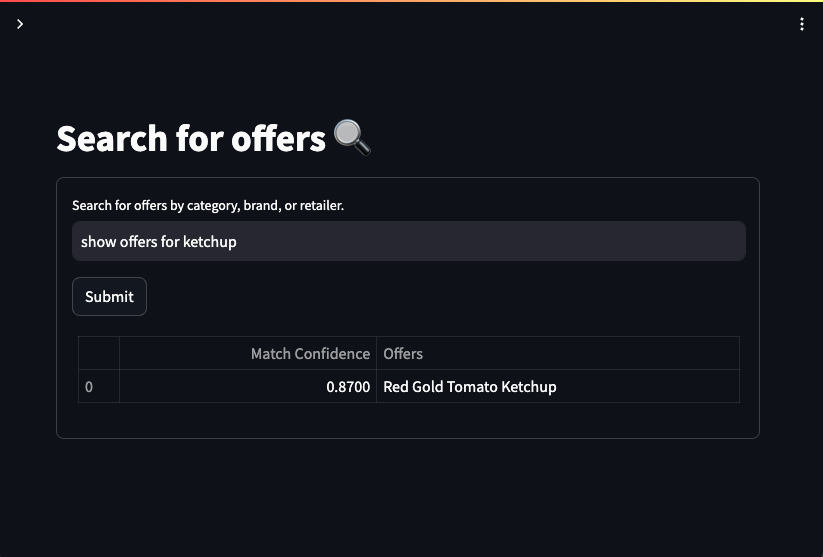
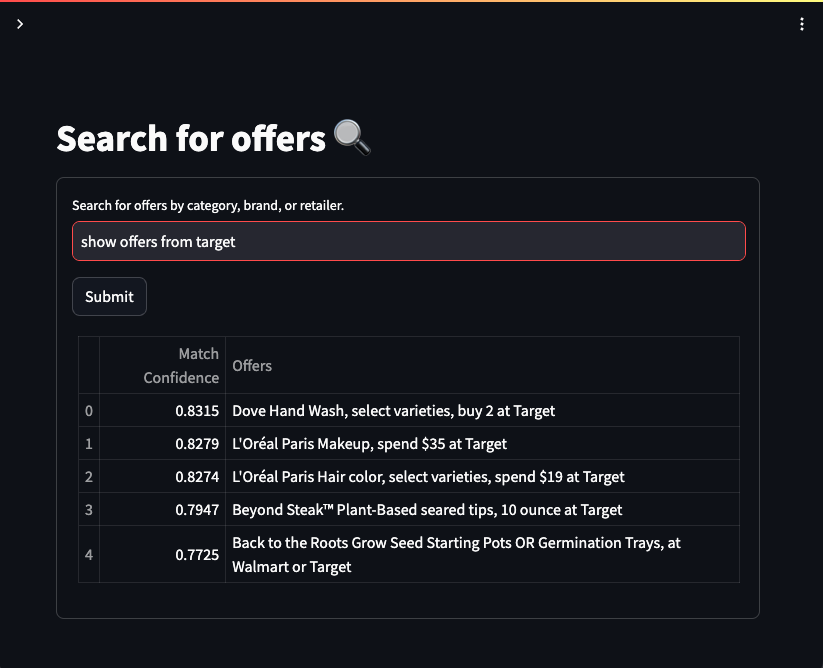
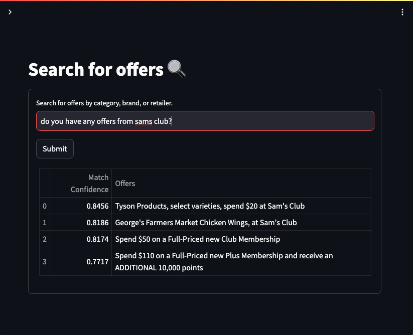
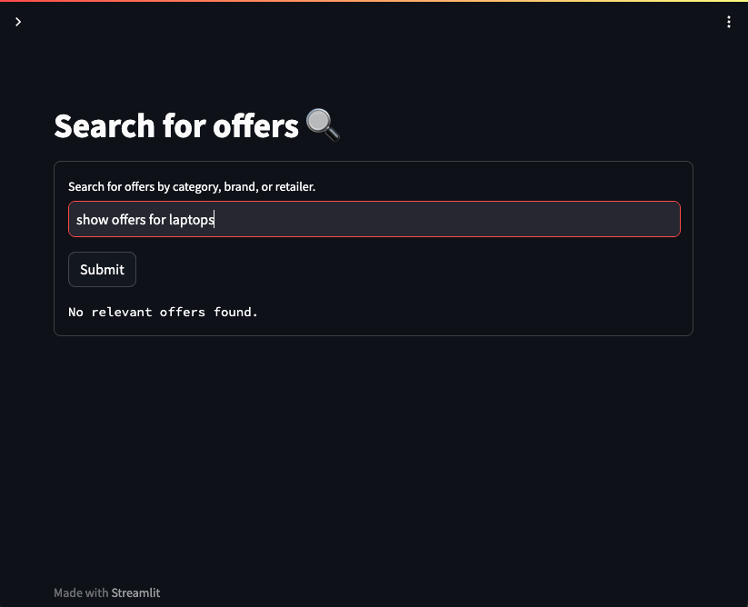

# LangChain + SQL

This is a LangChain + Streamlit web application for searching relevant offers from a SQLite database using an LLM and embeddings. Users can input a search query related to brand, category, or retailer, and the application will retrieve and display relevant offers from the database. The application uses the OpenAI API for natural language processing and embedding generation.

### Background

#### Approach

- **Objective:** The aim of this approach is to extract pertinent offers from the `offer_retailer` table based on product category, brand, or retailer queries. Given that the required data is dispersed across multiple tables within the `data` directory, a language model (LLM) was employed to facilitate intelligent database querying.

- **Database Preparation:** Initially, a local SQLite database was constructed using the data stored in `.csv` files located in the `data` directory. This was accomplished using the `sqlite3` and `pandas` libraries.

- **LLM Integration:** The integration of the Language Model (LLM) into the process was achieved via the `langchain_experimental.sql.SQLDatabaseChain`. This step enabled the LLM to interact with the local SQLite database effectively.

- **Prompt Engineering:** A vital aspect of this approach involved formulating a suitable prompt for instructing the LLM on the optimal method to retrieve and format database entries. Several iterations and experimentation were carried out to fine-tune this prompt.

- **Similarity Scoring:** To determine the relevance of retrieved results to the query, cosine similarity comparisons were performed. The `langchain.embeddings.OpenAIEmbeddings` facilitated the generation of embeddings for these comparisons, enabling results to be ranked accordingly.

- **Streamlit Integration:** The final step involved parsing the LLM's output and constructing a user-friendly Streamlit application around it, allowing users to interactively search for offers.

#### Trade-offs

- **Scalability:** It's important to note that this approach may face scalability challenges when dealing with larger datasets. In such cases, providing additional metadata to the LLM regarding the database schema may become necessary to maintain efficiency.

- **Security Concerns:** As with any database interaction, there is a potential vulnerability to SQL injection attacks. Implementing robust security mechanisms is essential to mitigate this risk.

- **Advanced Prompting:** While this approach achieves the desired functionality, more sophisticated prompts can be constructed through techniques like in-context learning or few-shot inference. Exploring these avenues may lead to even more accurate and versatile results.

### Prerequisites

Before you begin, ensure you have met the following requirements:

- Python 3.6 or higher
- OpenAI API key
- SQLite database containing tables: `brand_category`, `categories`, and `offer_retailer`

### Setup

1. Clone the repository:

   ```bash
   git clone https://github.com/sridhama/llm-sql
   cd llm-sql
   ```

2. Install the required packages:

   ```bash
   pip install -r requirements.txt
   ```

3. Obtain an OpenAI API key from [OpenAI Platform](https://platform.openai.com/account/api-keys) and add it to the application when prompted.

4. Make sure your SQLite database is set up with the necessary tables (`brand_category`, `categories`, `offer_retailer`).

### Usage

To run the application locally, use the following command:

```bash
cd <repository-directory>
./run/run.sh
```

Once the application is running, open your browser and navigate to `http://localhost:8501` to access the offer search interface.


### Run online

You can access the application through [Google Colab](https://colab.research.google.com/drive/1aEmzQAjk5Hg2C4m4zinoIGyv9C3_wZzu?usp=sharing). Just create a copy of the notebook and follow the instructions within.

### How to Use

1. Enter your search query (brand, category, or retailer) in the text input field.
2. Click the "Submit" button to initiate the search.
3. Relevant offers matching the query will be displayed in a table format.

### Notes

- Make sure to provide the correct OpenAI API key for the application to function properly.
- Ensure the SQLite database contains the required tables and necessary data for accurate search results.

---

### Examples









